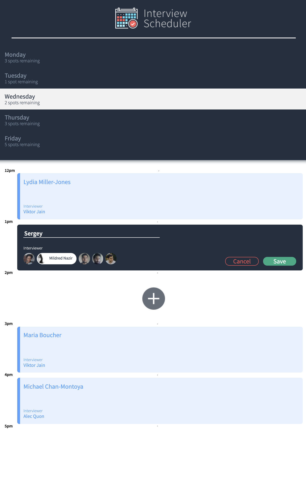
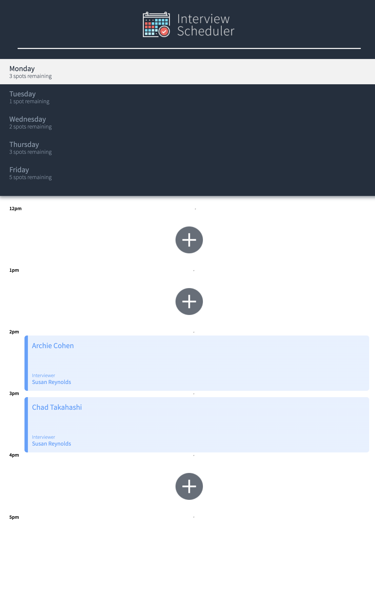

# Scheduler

## Setup

The Scheduler is a single page app that allows users book an appointment, edit, cancel and choose from available spots fetched from an PSQL api server.
It is built in React.js using CSS, SASS and HTML. 

## Setup

Install dependencies with `npm install`.

## Running Webpack Development Server

```sh
npm start and visit your browser on localhost:8000
```

## Running Database Server

visit: https://github.com/lighthouse-labs/scheduler-api

## Running Database Server
Follow the instructions provided and run the server on localhost:8001

This app was designed in pre-historic smart-phone era, and built in 2021, as a learning activity. 
It by no means serve any viable purpose. Took 11 days to build, and should take no longer than 11 seconds to view the screenshots attached below.

Thank you!



